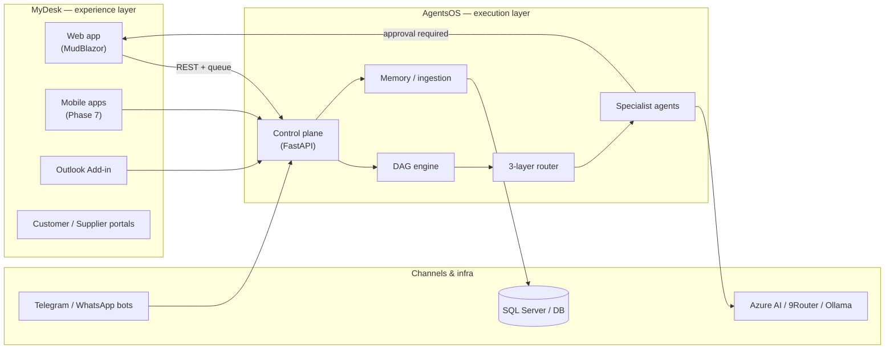
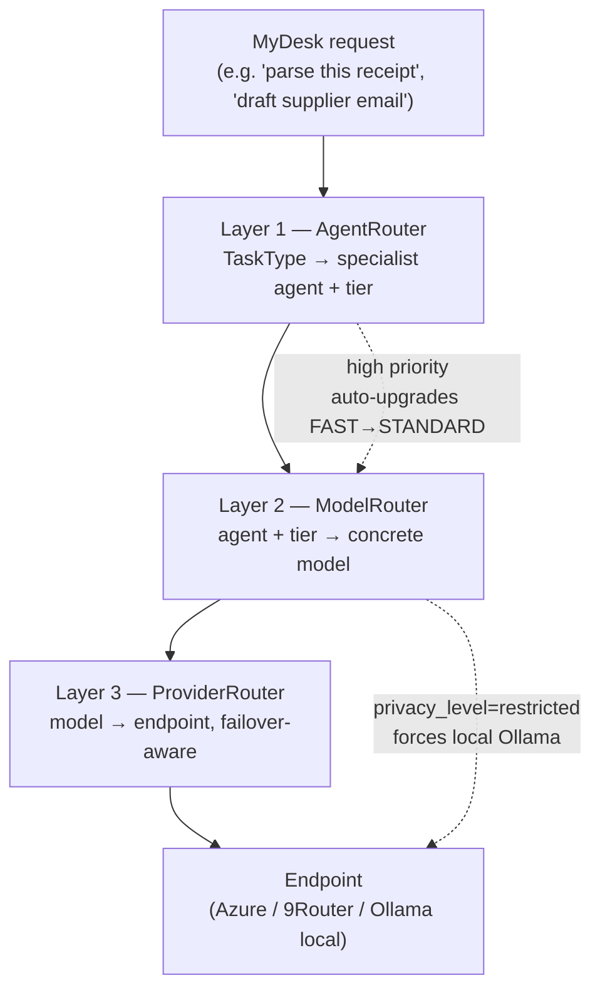
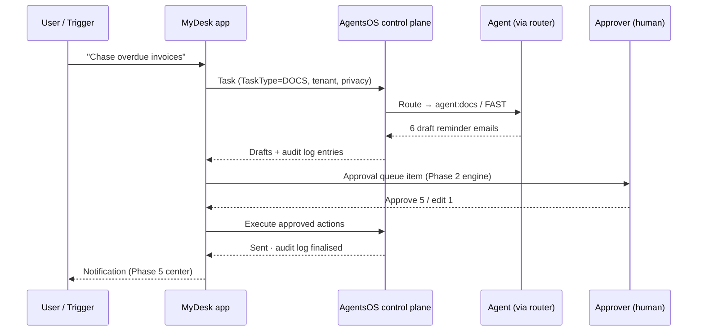

# MyDesk × AgentsOS — Integration Architecture & Plan

**Last Updated:** July 2026
**Source repo:** `C:\Development\agentsos.digitalresponse.com.au` (AgentsOS platform — canonical; `C:\Development\AgentsOS` is the same folder via junction until the rename completes)
**Related:** [ROADMAP.md](ROADMAP.md) · [ARCHITECTURE-DECISIONS.md](ARCHITECTURE-DECISIONS.md) · [../AI TRENDS.md](../AI%20TRENDS.md) · [../APPROVAL-WORKFLOWS.md](../APPROVAL-WORKFLOWS.md)

---

## 1. Why this document

MyDesk is the **experience layer** (apps, approvals, dashboards); AgentsOS is the **execution layer** (agents, routing, DAG orchestration). This doc maps everything the AgentsOS repo provides onto MyDesk's phases so nothing in the platform goes unused or undocumented on the app side.



---

## 2. AgentsOS component inventory → MyDesk touchpoints

Everything in the AgentsOS repo, what it does, and where MyDesk consumes it:

| AgentsOS component | Path (AgentsOS repo) | What it does | MyDesk touchpoint | Integration mechanism | Status | Target phase |
|---|---|---|---|---|---|---|
| Control plane API | `control-plane/app/main.py`, `api/` | FastAPI entry point for all agent requests | Server-side service calls from MyDesk backend | REST (MCP candidate — see AI TRENDS §MCP) | ✅ Running | Now |
| DAG engine | `control-plane/app/dag/` | Multimodal DAG plan/execute with gated steps | "AgentsOS DAG" visualizer (wireframes §5) | REST + WebSocket status feed | ✅ Running | Phase 6 |
| 3-layer router | `control-plane/app/router/` | Agent → Model → Provider deterministic routing | Invisible to users; ops panel shows chosen tier/model | Internal to control plane | ✅ Tested (`tests/test_routing.py`) | Now |
| Orchestrator | `control-plane/app/orchestrator/` | Task scheduling, retries, queue management | Job status chips in dashboard | Queue (`app/queue/`) | ✅ Running | Phase 6 |
| Memory & ingestion | `control-plane/app/memory/`, `ingestion/` | Long-term context, document ingestion | Files Library enrichment; AI receipt parsing corpus | Batch ingestion jobs | 🔄 Partial | Phase 8 |
| Executor | `control-plane/app/executor/` | Sandboxed tool/step execution | n/a (server-side) | Internal | ✅ Running | Now |
| Evolution worker | `workers/evolution-worker/` | Self-improvement loops over agent performance | Ops metrics page | Metrics DB | 🔄 Partial | Phase 9 |
| Runtime workers | `workers/runtime/`, `runtime-worker/` | Long-running agent jobs off the request path | Background job list + notifications (Phase 5) | Queue + notification center | ✅ Running | Phase 5 |
| Obsidian watcher | `workers/obsidian-watcher/` | Second-brain file sync into memory | Knowledge search inside MyDesk AI Assistant | Ingestion pipeline | 🔄 Partial | Phase 8 |
| Hermes bridge | `control-plane/tests/test_hermes_bridge.py` (bridge in `providers/`) | Bridge to Hermes travel/wiki services | Optional tenant integration | REST | 📋 Planned | Phase 10 |
| Bot channels | (C4 diagram: Telegram / WhatsApp) | Conversational entry to agents | Mirror of MyDesk AI Assistant on chat channels | Control plane webhooks | ✅ Running | Now |
| Marketing site | `marketing-site/`, `products/marketing-website/` | agentsos.digitalresponse.com.au | Cross-link from MyDesk marketing site roadmap | Static | ✅ Live copy updated | Now |
| Skills library | `skills/` | Reusable agent skill definitions | Per-tenant agent catalogs (Techlight-pattern rollouts) | Config | ✅ Running | Now |
| GitTools toolkit | `tools/GitTools/` | Repo governance (inventory, health, secrets scan) | DevOps hygiene for this repo too — run `Invoke-GitHealth` | PowerShell module | ✅ Available | Now |

---

## 3. Routing: what happens to every MyDesk AI request

Three deterministic layers (full detail: AgentsOS `docs/ROUTING-ARCHITECTURE-REPORT.md`):



Agent catalog as it applies to MyDesk features:

| TaskType | Agent | Default tier | Typical model | MyDesk feature using it | Privacy note |
|---|---|---|---|---|---|
| CODING | `agent:code` | PREMIUM | gpt-5.5 | Custom report formulas, workflow scripting | Cloud |
| VISION | `agent:vision` | VISION | qwen-vl-max | **Receipt capture & parsing (Phase 8)** | Restricted → local |
| DOCS / WRITING | `agent:docs` | FAST | gemini-flash | Email/SMS notification drafting (Phase 5) | Cloud |
| RESEARCH | `agent:research` | STANDARD | gemini-2.5-pro | Supplier/company enrichment in CRM | Cloud |
| BROWSER | `agent:browser` | STANDARD | claude-sonnet-4 | Bank-portal fetch fallbacks (Phase 3) | Restricted → local |
| INFRA | `agent:infra` | STANDARD | claude-sonnet-4 | Ops runbooks, deployment checks | Cloud |
| GENERAL | `agent:code` | STANDARD | gpt-5.4 | AI Assistant catch-all | Cloud |

> `privacy_level=restricted` forces local/Ollama models regardless of tier — this is the mechanism behind the "sensitive data stays local" commitment in tenant proposals.

---

## 4. Approval flow — how MyDesk keeps humans in the loop

Every agent action that books, sends or spends passes through MyDesk approvals (see [../APPROVAL-WORKFLOWS.md](../APPROVAL-WORKFLOWS.md)):



---

## 5. Dashboard mock-up — AgentsOS surfaces inside MyDesk

Wireframe of the Phase 6 dashboard panel (canonical low-fi set: `../wireframes/index.html` §1 and §5, new system in `../Design/`):

```
┌──────────────────────────────────────────────────────────────────────────┐
│ MyDesk ▸ Dashboard                                   🔍  🔔(3)  ⚙  PB ▾ │
├────────────┬─────────────────────────────────────────────────────────────┤
│ ⌂ Home     │  ✦ Ask or instruct…  "which suppliers are over budget?"     │
│ 💳 Expenses│ ┌─────────┬──────────┬──────────┬──────────────────────────┐ │
│ ✅ Approvals│ │ 7       │ 12       │ 3        │ $48.2k                  │ │
│ 👥 Teams   │ │ Approvals│ Agent    │ Deadlines│ Draft invoices          │ │
│ 📊 Analytics│ │ waiting │ tasks    │ this week│ ready                   │ │
│ 🤖 AgentsOS│ └─────────┴──────────┴──────────┴──────────────────────────┘ │
│ ⚙ Settings │  AGENT ACTIVITY — LIVE                                      │
│            │ ┌───────────────────────────┬───────────────────────────┐   │
│            │ │ 📥 Receipt Parser         │ 💳 Reconciliation Agent   │   │
│            │ │ 14 receipts → categorised │ Bank feed matched 96%     │   │
│            │ │ [Review & approve]        │ [Review 3 exceptions]     │   │
│            │ └───────────────────────────┴───────────────────────────┘   │
│            │  DAG: monthly-close ▸ ●──●──●──◐──○   [view graph]          │
└────────────┴─────────────────────────────────────────────────────────────┘
```

DAG visualizer states (wireframes §5): `●` done · `◐` awaiting human gate · `○` pending.

---

## 6. Roadmap alignment — MyDesk phases × AgentsOS capabilities

| MyDesk phase | Timeline | AgentsOS capability consumed | Dependency / blocker | Risk | Owner |
|---|---|---|---|---|---|
| Phase 5 — Notifications | Q4 2026 | Runtime workers → notification events; `agent:docs` drafting | Notification center API stable | Low | Core |
| Phase 6 — Dashboards | Q4 2026–Q1 2027 | DAG status feed, orchestrator job chips, agent activity stream | WebSocket feed from control plane | Med — feed not yet versioned | Core + AgentsOS |
| Phase 7 — Mobile | Q1 2027 | Same control-plane API, push-notification hooks | Phase 5 events; mobile auth | Med | Mobile |
| Phase 8 — AI receipt parsing | Q1 2027 | `agent:vision` (qwen-vl-max), memory/ingestion corpus | Labelled receipt set; privacy routing verified | Med | AI |
| Phase 9 — Forecasting/ML | Q2 2027 | Evolution worker metrics, research agent | Phase 6 data warehouse | High — model quality | AI |
| Phase 10 — Procurement/multi-org | Q2–Q3 2027 | Hermes bridge pattern for external services; multi-tenant router policies | Tenant isolation review | Med | Platform |

---

## 7. Gaps found while mapping (action items)

| # | Gap | Where | Proposed fix | Effort |
|---|---|---|---|---|
| 1 | Control-plane REST is bespoke; AI TRENDS recommends MCP host migration | `control-plane/app/api/` | Expose MCP server alongside REST; MyDesk becomes MCP host | M |
| 2 | DAG status feed consumed ad-hoc | Phase 6 dashboard | Version the WebSocket contract before Phase 6 GA | S |
| 3 | AgentsOS repo hygiene | AgentsOS repo | GitTools health 77/B — add SECURITY.md/CONTRIBUTING.md via repo-template; also run `Invoke-GitHealth` on this repo | S |
| 4 | Approval taxonomy drift | APPROVAL-WORKFLOWS.md vs AgentsOS gates | Single source: MyDesk approval types referenced by DAG gate config | M |
| 5 | Local-model privacy path untested end-to-end from MyDesk | Router L2 `privacy_level` | Add integration test: restricted request → Ollama endpoint asserted | S |

---

*Prepared by Digital Response · diagrams are Mermaid (render on GitHub) · ASCII mock-up mirrors `wireframes/index.html`; hi-fi versions live in `../Design/`.*
