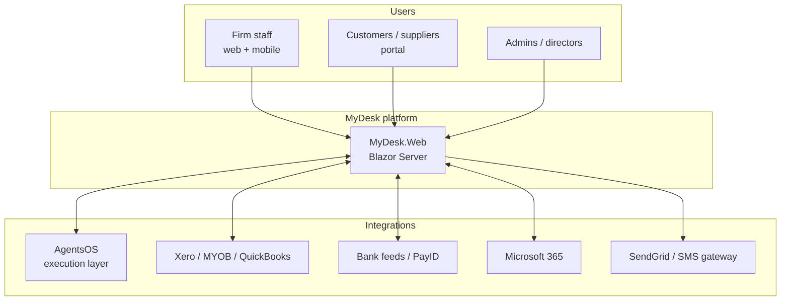
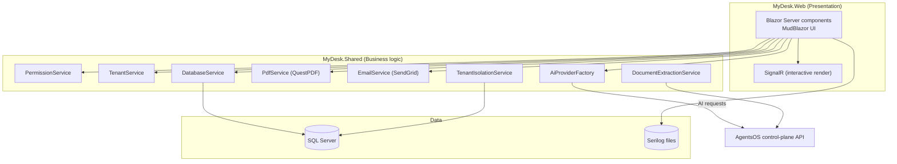
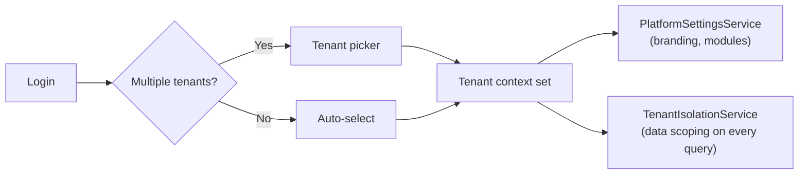
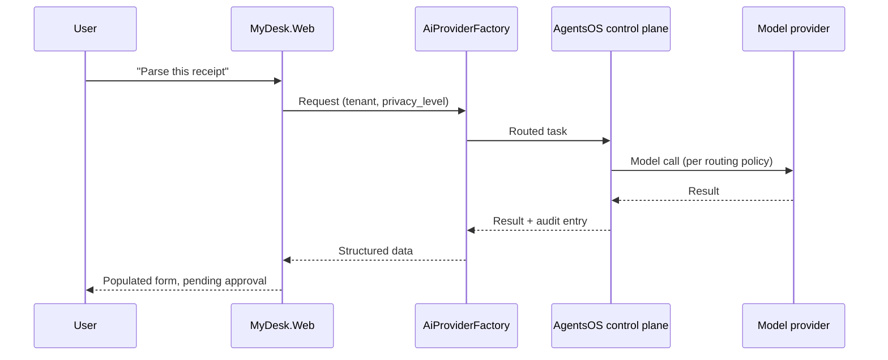
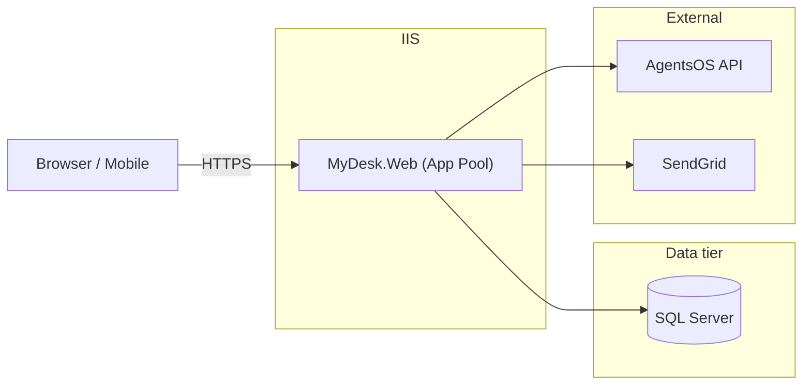

# MyDesk — Solution Design Document

**Version:** 1.0 · **Last updated:** July 2026 · **Owner:** Digital Response
**Audience:** technical evaluators, client IT/security teams, implementation partners
**Related:** [../ARCHITECTURE.md](../ARCHITECTURE.md) · [../SECURITY.md](../SECURITY.md) · [ROADMAP.md](ROADMAP.md) · [AGENTSOS-INTEGRATION.md](AGENTSOS-INTEGRATION.md) · Marketing trust page: `mydesk.digitalresponse.com.au/trust/mydesk`

---

## 1. Purpose & scope

MyDesk is the **experience layer** of the Digital Response platform stack: a multi-tenant .NET 10 Blazor Server business-management platform (CRM, quoting, invoicing, purchase orders, job tracking, approvals, BI) with AgentsOS as its governed AI execution layer underneath. This document is the technical solution design; `../ARCHITECTURE.md` is the shorter engineering-onboarding version, `../SECURITY.md` is the security control reference, and this file is the client-facing evaluation document that ties them together with diagrams and deployment options.

## 2. System context (C4 — Level 1)

## 3. Container view (C4 — Level 2)

## 4. Multi-tenancy model

Each client is a tenant. `TenantService` + `PlatformSettingsService` resolve branding, modules and permissions per active tenant at login; `TenantIsolationService` enforces data isolation at the query layer (see `../ARCHITECTURE.md` §Multi-Tenancy, `../SECURITY.md` for enforcement points).

## 5. AgentsOS integration boundary

MyDesk never calls model providers directly — every AI-assisted feature (Ask AI, receipt extraction, drafting) routes through `AiProviderFactory` to the AgentsOS control-plane API, which applies the 3-layer router and `privacy_level` enforcement described in AgentsOS's own `docs/SOLUTION-DESIGN.md`. This is the security boundary that keeps client data handling consistent regardless of which MyDesk feature triggers it.

Full component inventory and phase mapping: [AGENTSOS-INTEGRATION.md](AGENTSOS-INTEGRATION.md).

## 6. Deployment options

| Model | Description | Data residency | Notes |
|---|---|---|---|
| **Digital Response managed hosting** | IIS on Digital Response infrastructure, monitored and patched | Australian region | Default for new engagements |
| **Client Azure tenant** | Deployed into client's own Azure App Service / VM | Client-controlled | For clients with existing Azure estate (e.g. legal/regulated) |
| **On-premises IIS** | Client-hosted Windows Server + SQL Server | Never leaves the building | Available where required; see hardening checklist in `../SECURITY.md` |

## 7. Non-functional requirements

| Attribute | Target | Mechanism |
|---|---|---|
| Availability | 99.9% (managed tier) | IIS app pool recycling, monitored uptime, documented in trust page |
| Auditability | All user actions + AI interactions logged | `Activity` and `AiAudit` tables (see `../SECURITY.md` §Logging & Audit) |
| Data protection | Encrypted in transit (HTTPS), parameterized queries, Blazor auto-encoding | See `../SECURITY.md` §Data Protection |
| Scalability | Horizontal via multiple app-pool instances behind load balancer (roadmap) | Currently single-instance per tenant; documented as a Phase 9+ consideration |
| Recoverability | Regular database backups, documented restore procedure | Ops runbook (client-specific) |

## 8. Known gaps (tracked, not hidden)

Carried over honestly from `../SECURITY.md` §Known Security Considerations and §Future Security Enhancements — a due-diligence reviewer will find these called out, not discovered:

| Gap | Status | Target |
|---|---|---|
| Legacy plain-text password fallback | Mitigation in place (BCrypt-first, plain-text fallback for unmigrated accounts) | Forced reset migration — Phase 6 |
| No 2FA | Not yet implemented | Roadmap — Future Security Enhancements |
| No SSO (Azure AD) | Not yet implemented | Roadmap — Future Security Enhancements |
| Single-instance scaling | No load-balanced horizontal scaling yet | Phase 9+ consideration |
| Security headers (CSP, HSTS) | Not yet enforced by default | Roadmap — Future Security Enhancements |

## 9. Roadmap alignment

See [ROADMAP.md](ROADMAP.md) for the 10-phase plan and [AGENTSOS-INTEGRATION.md](AGENTSOS-INTEGRATION.md) §6 for how each phase consumes AgentsOS capability.

---
*This document is the technical companion to the customer-facing trust page (`/trust/mydesk`). Keep both in sync when architecture, integration or security controls change.*
